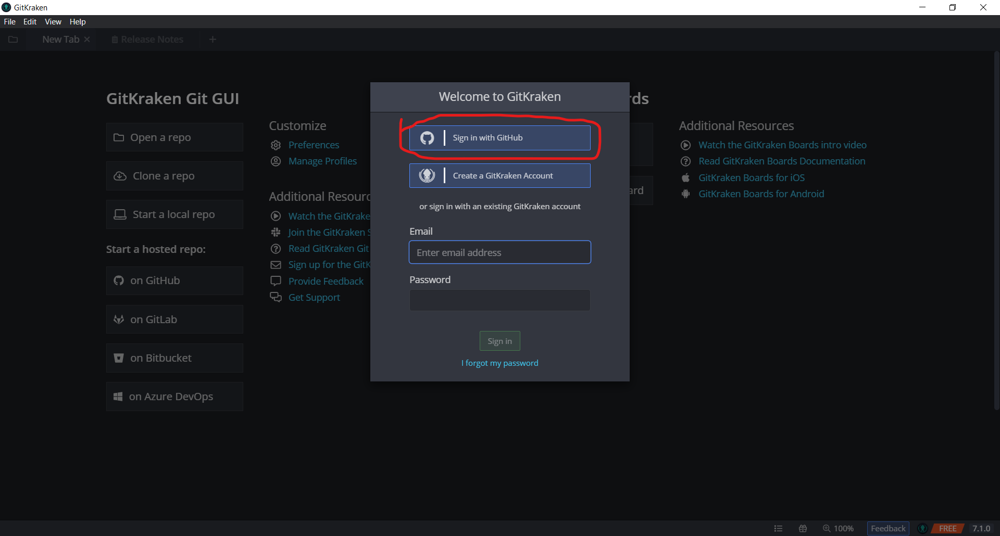
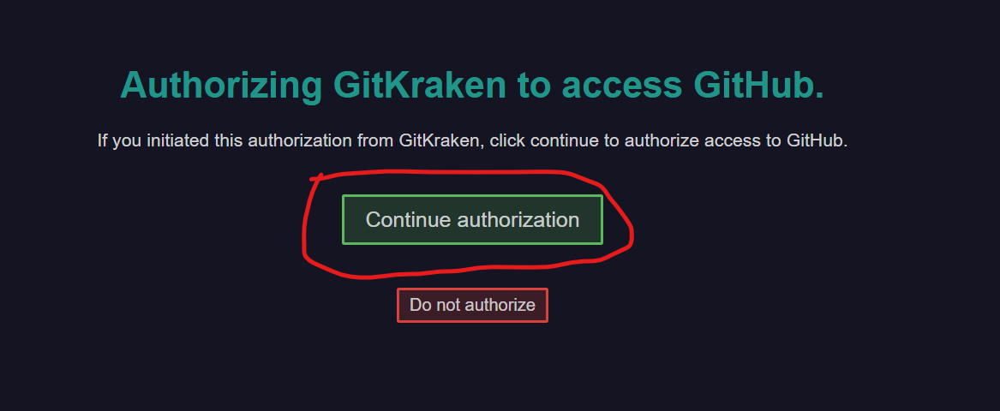
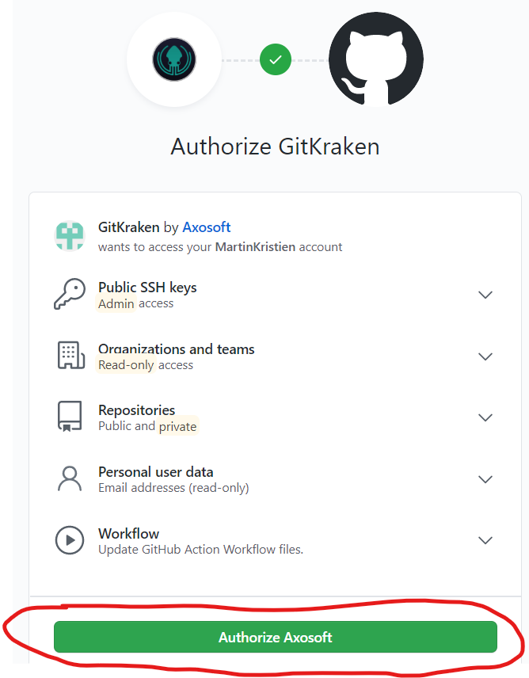

# Čo treba nainštalovať
Git pracuje s konceptom *úložiska*.
Na workshope budeme pracovať s naším vlastným úložiskom.
Aby sme úložisko mohli načítať a zasahovať doň, potrebujeme viacero nástrojov:

|Meno     |na čo?|čo?|
|-|-|-|
|GitHub   |hosťovanie vzdialeného úložiska|online platforma, podobné s google-docs|
|GitKraken|práca s lokálnym úložiskom|aplikácia v počítači|
|email    |užívateľské ID na vytvorenie GitHub účtu, authorizácia|

## Ako si vytvoriť GitHub účet
- choď na [GitHub](https://github.com/) a klini na *Sign Up* (v pravo hore)
- vyber si uživateľské meno, email, heslo
- choď na svoj email, aktivuj si GitHub účet cez aktivačný email

## Ako získať prístup k úložisku
- pošli svoje GitHub meno lektorovi na `martin.kristien@gmail.com`
- počkaj na email s pozvánkou k spoluprácií na úložisku
- potvrď pozvánku k spoluprácií na úložisku

## Ako si nainštalovať GitKraken
- stiahni a nainštaluj [GitKraken GUI](https://www.gitkraken.com/)
- prepoj si GitKraken s GitHub účtom
- vyber si GitKraken meno a email, tieto údaje budú tvoriť podpis pod tvojimi príspevkami

