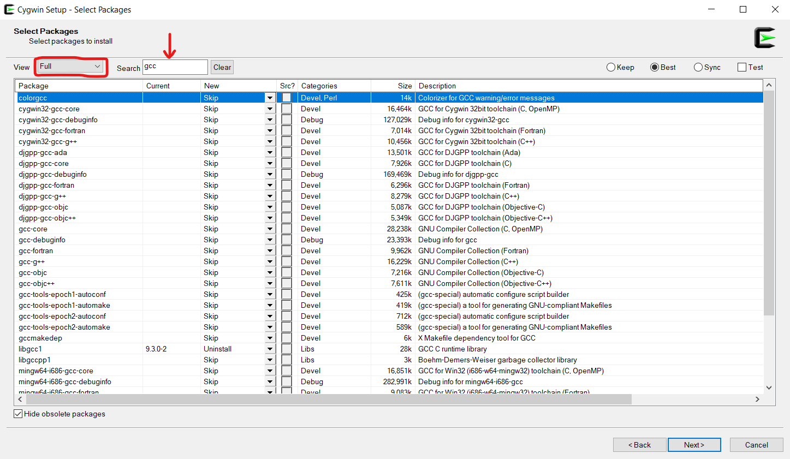

## Čo treba nainštalovať
Na vývoj C++ aplikácii potrebujeme len dve veci, textový editor a terminál:

|Nástroj|na čo?|
|-|-|
|[VisualStudioCode](https://code.visualstudio.com/)|textový editor|
|[Cygwin](https://cygwin.com/install.html)|Linuxový terminál pre Windows|

# Čo je to Cygwin?
Cygwin je terminálové prostredie ktoré pripomína Linux ale zároveň sa dá spustiť na Windowse.
V tomto prostredí si môžeme jednoducho nainštalovať ďalšie nástroje ktoré budeme počas workshopu používať.
Stačí spustiť súbor `setup-x86_64.exe` a preklikať sa k oknu pre výber nástrojov (`Select Packages`).
Zmeň si `View` na `Full`, aby sa ti zobrazili všetky dostupné nástroje.
V okienku `Search` môžeš vyhľadávať  nástroje ktoré chceš nainštalovať.

Na workshope budeme používať tieto nástroje:
|`Package`|`Version`|`Description`|
|-|-|-|
|gcc-g++|10.2.0-1|GNU Compiler Collection (C++)|
|make|4.3-1|The GNU version of the 'make' utility|
|nano|4.9-1|Enhanced clone of Pico editor|
|git|2.28.0-1|Distributed version control system|

Po výbere nástrojov stačí dokončiť inštaláciu použitím tlačidla `Next`.
Následne môžeš otvoriť terminálové okno `Cygwin` a napísať terminálový príkaz `echo "hello AjTyvIT"`.
Príkaz sa spustí stlačením tračidla Enter.
