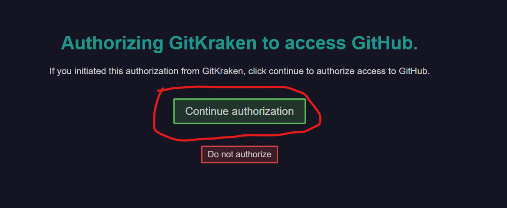

# Installation Guide
Git always operates over *repositories*, i.e. a collection of files representing our project.
We will be working with a custom repository created just for the purposes of this workshop.
To gain access to the repo, we will need the following:

|Item     |what it is for?|what it is?|
|-|-|-|
|GitHub   |web hosting of the repository|an online platform, similar to google-drive|
|GitKraken|accessing local copy of the repository|a desktop application|
|email    |required for GitHub account creation and git authorisation|

## How to create a GitHub account
- go to [GitHub](https://github.com/) and click *Sign Up* (upper right corner)
- choose a user name, email, and password
- verify your email address by confirming the activation email

## How to get access to the repository
- send your GitHub username to the Zoom chat or by email to the lector `martin.kristien@gmail.com`
- accept the invitation to collaborate sent to your email address

## How to install GitKraken
- download and install [GitKraken GUI](https://www.gitkraken.com/)
- open GitKraken application and integrate with your GitHub account
- choose a GitKraken name and email (this information will be used to sign your contributions to the repo)

