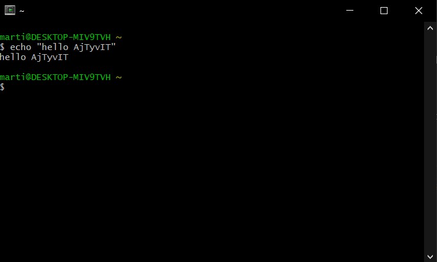

# Čo treba nainštalovať
[Cygwin](https://cygwin.com/install.html) - Linuxový terminál pre Windows

Cygwin je terminálové prostredie ktoré pripomína Linux ale zároveň sa dá spustiť na Windowse.
V tomto prostredí si môžeme jednoducho nainštalovať ďalšie nástroje ktoré budeme počas workshopu používať.
Stačí stiahnuť a spustiť súbor `setup-x86_64.exe` a preklikať sa cez inštaláciu.

Po inštalácií by si mala byť schopná otvoriť terminálové okno `Cygwin64 Terminal` a napísať príkaz `echo "hello AjTyvIT"`.
Príkaz sa spustí stlačením tračidla Enter.

