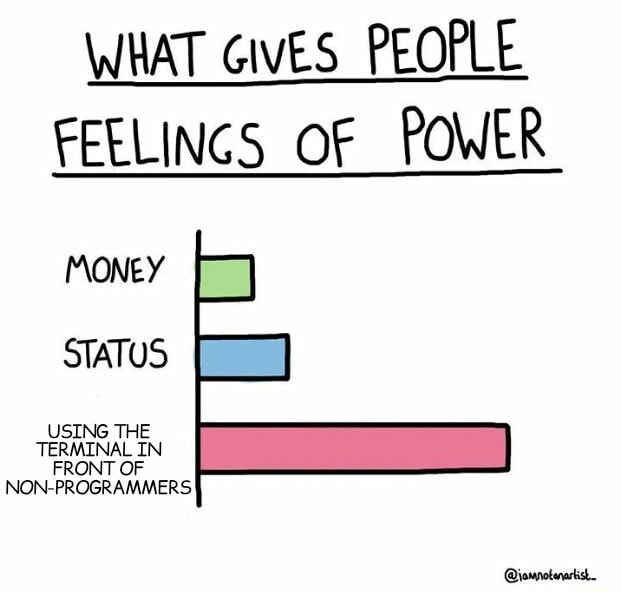

# Navigácia v Termináli - Ako pracovať na počítači bez myšky

## Popis workshopu
Terminál je neodmysliteľný nástroj každej programátorky, ktorá sa snaží zvýšiť svoju produktivitu a znalosti práce na svojom počítači. Nielenže terminál často ponúka rýchlejšie riešenie problémov oproti typickému klikania myšou, ale niektoré nástroje jednoducho nemajú žiadne grafické prostredie. Áno, terminál je výlučne textuálny. Preto budeme na workshope používať viacej klávesnicu ako myš. Navyše, keď si otvoríš terminál, ostatné spolužiačky si budú myslieť, že si hackerka.

## Obsah workshopu
Počas workshopu sa budeme pohybovať najmä v prostredí operačného systému Linux. Budeme tiež používať veľa anglickej terminológie, no všetko si vysvetlíme, takže netreba mať vysokú znalosť angličtiny.

Po workshope budeš ovládať:
- základné príkazy v termináli
- narábanie so súbormi
- pracovanie na vzdialenom serveri
- sťahovanie a inštalácia programov z internetu

## O lektorovi
Martin študuje počítačovú vedu na Edinburghskej univerzite.
Venuje sa hlavne nízko-úrovňovému systémovému programovaniu, ale zaujímajú ho aj oblasti dátovej vedy a umelej inteligencie.
Popri štúdiu vyučuje, či už na univerzite alebo v rámci stredoškolských letných táborov [Akadémie Discover](https://discover.sk/).

